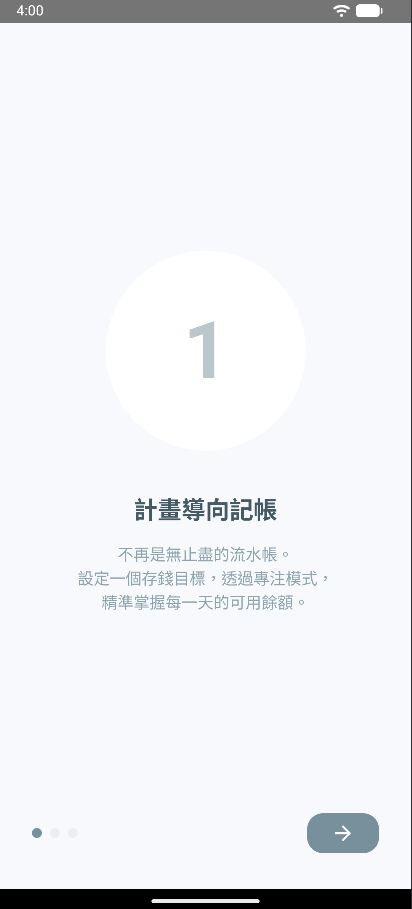
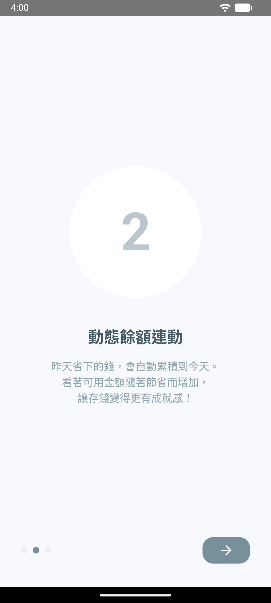
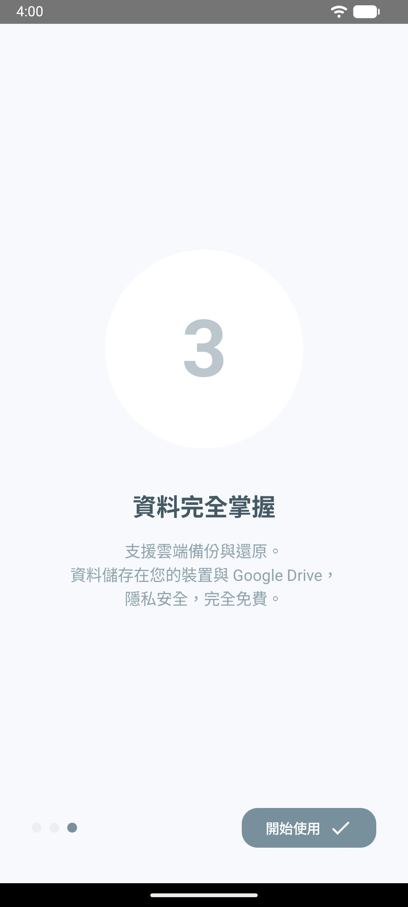
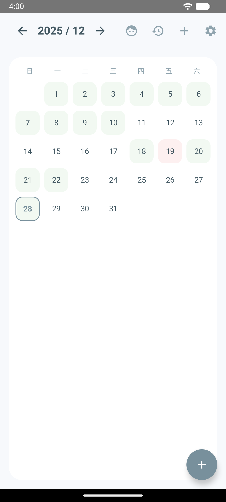
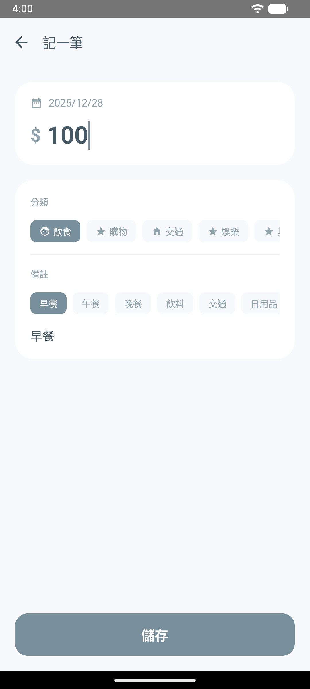
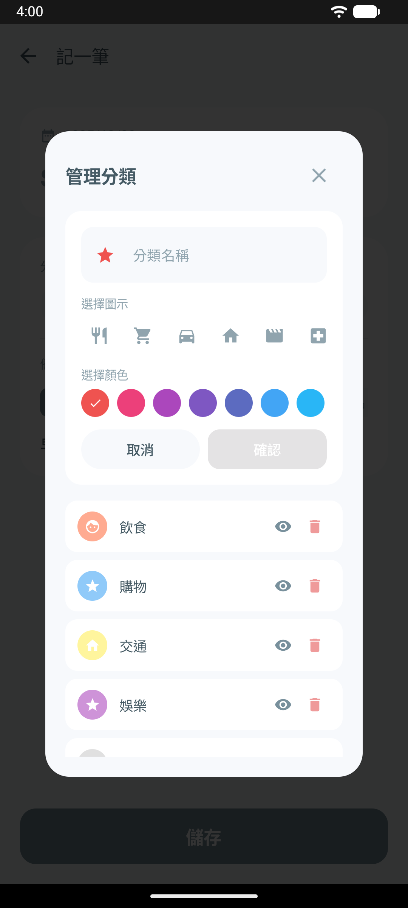
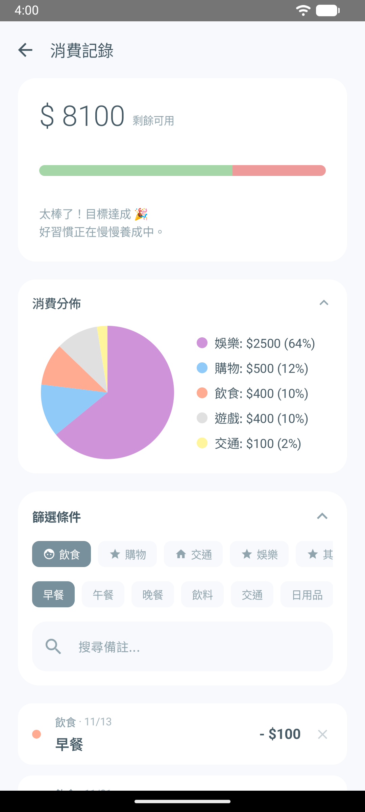
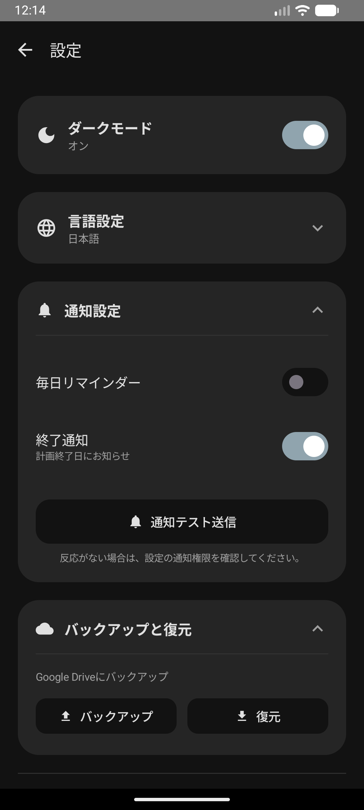

# 📋 Budget Quest - 極簡風格計畫導向記帳 App

| 計畫導向記帳 | 動態餘額連動 | 資料完全掌握 |
| --- | --- | --- |
|  |  |  |

### 📖 專案簡介 (Introduction)

**Budget Quest** 是一款基於 **MVVM 架構** 與 **Jetpack Compose** 開發的現代化 Android 記帳應用程式。

有別於傳統的流水帳 App，本專案採用 **「庫存管理 (Inventory Management)」** 的核心邏輯。使用者設定一段時間的預算目標（計畫），系統透過 **「專注模式」** 與 **「月曆模式」** 的動態切換，協助使用者精準控制每日的「剩餘金錢」，將記帳變成一場達成目標的任務。

---

### ✨ 主要功能 (Core Features)

#### 1. 沉浸式儀表板 (Dashboard)

* **專注模式 (Focus Mode)**：極簡化介面，移除多餘干擾，透過 **跳動數字動畫 (Rolling Number)** 顯示今日可用餘額。綠色代表安全，紅色代表超支，讓財務狀況一目瞭然。
* **月曆總覽 (Calendar Mode)**：直觀的月曆視圖，每日格子上直接顯示當日結餘，提供宏觀的財務視角，點擊即可快速跳轉至當日明細。
* **防手震優化**：全域按鈕與頁面切換皆導入 **Debounce (防抖)** 機制，杜絕誤觸與重複開啟頁面的問題，操作手感更扎實。

#### 2. 高度客製化記帳 (Transaction & Customization)

* **自訂分類系統**：使用者不只能新增、編輯、刪除分類，還支援 **自選圖示 (Icon) 與 色彩 (Color)**。
* **智慧防呆**：新增消費時，系統會自動快取日期與分類，並優化了鍵盤與輸入框的互動流暢度，讓記帳過程行雲流水。

#### 3. 計畫與訂閱管理 (Plan & Subscription)

* **計畫導向**：支援建立多個不同週期的存錢計畫（例如：旅行基金、月度預算），系統自動防止日期重疊，確保每一分錢都在規劃之中。
* **固定扣款**：獨立的訂閱管理頁面，支援「每月、每週、每日、自訂間隔」的自動扣款設定，並自動寫入當期計畫，無需重複輸入。

#### 4. 系統架構與資料安全

* **雲端備份**：整合 Google Drive (SAF)，支援資料庫的備份與還原 (Local-First)，資料掌握在使用者自己手中。
* **背景通知**：整合 WorkManager 進行每日記帳提醒，確保不錯過任何一筆消費。

---

### 🎨 使用體驗優化 (UX & Personalization)

#### 1. 新手引導與按鈕教學 (Onboarding & Coach Marks)

* **首次引導 (Onboarding)**：初次使用時，App 會透過流暢的引導頁面，協助使用者建立第一個計畫，降低學習門檻。
* **互動式教學 (Coach Marks)**：進入主畫面後，系統會透過 **聚光燈效果 (Spotlight Overlay)** 逐一介紹介面上的功能按鈕（如切換模式、歷史紀錄、設定等），讓使用者能在操作中自然學會如何使用。

#### 2. 深色模式支援 (Dark Mode)

* 完美適配 **深色主題 (Dark Theme)**。無論是在白天還是夜晚記帳，介面配色皆經過精心調校，確保閱讀舒適不刺眼，同時節省電力。

#### 3. 多語言介面 (Localization)

* 內建完整的國際化支援，App 會根據手機系統語言自動切換，亦可正確顯示對應的預設分類與備註名稱：
* 🇹🇼 **繁體中文 (Traditional Chinese)**
* 🇺🇸 **英文 (English)**
* 🇯🇵 **日文 (Japanese)**
* 🇨🇳 **簡體中文 (Simplified Chinese)**


---

### 📱 畫面展示 (Screenshots)

| 1. 專注儀表板 | 2. 月曆總覽模式 | 3. 新增/編輯消費 |
| --- | --- | --- |
|  |  |  |

| 4. 自訂分類管理 | 5. 統計分析 | 6. 深色模式與多語言 |
| --- | --- | --- |
|  |  |  |

---

### 🛠️ 技術架構 (Tech Stack)

* **語言**：Kotlin
* **UI 框架**：Jetpack Compose (Material Design 3)
* **架構模式**：MVVM (Model-View-ViewModel) + Repository Pattern
* **非同步處理**：Coroutines & Flow (StateFlow / SharedFlow)
* **本地資料庫**：Room Database (SQLite)
* 完整 Entity 關聯 (Plan, Expense, Category, Tag)
* Database Migration (V1 -> V8)


* **導航**：Navigation Compose (Single Activity Architecture)
* **背景任務**：WorkManager
* **效能優化**：
* `rememberSaveable` 狀態保存
* Global Click Debouncing (防手震)
* Lazy Layout Optimization (Key-based recomposition)


---

### 📂 主要專案結構 (Project Structure)

```text
com.example.budgetquest
├── data/                   # Model 層
│   ├── BudgetDatabase.kt   # Room DB 定義 & 預設資料填充
│   ├── Entity.kt           # 資料表 (Expense, Category, Subscription...)
│   └── BackupManager.kt    # Google Drive 備份邏輯
│
├── ui/                     # View 層 (Compose UI)
│   ├── dashboard/          # 主畫面 (儀表板、專注/月曆模式)
│   ├── transaction/        # 記帳功能 (含 CategoryManager)
│   ├── plan/               # 計畫設定
│   ├── summary/            # 統計圖表
│   ├── subscription/       # 固定扣款 (訂閱管理)
│   ├── settings/           # 設定 (深色模式、備份)
│   ├── history/            # 歷史計畫回顧
│   ├── onboarding/         # 首次引導頁
│   └── common/             # 共用元件 (動畫數字, CoachMarks, Helper)
│
└── worker/                 # 背景工作
    └── ReminderWorker.kt   # 通知推播

```

---

### 🚀 如何執行 (Getting Started)

1. Clone 本專案到本地端。
2. 使用 Android Studio (建議 Ladybug 或更新版本) 開啟。
3. 等待 Gradle Sync 完成。
4. 連接實機或模擬器 (建議 API 26+)。
5. 點擊 **Run**。

---

### 📄 License

本專案為個人學習用途。
