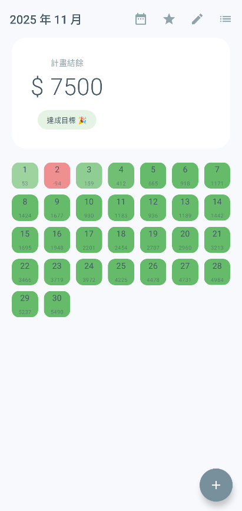
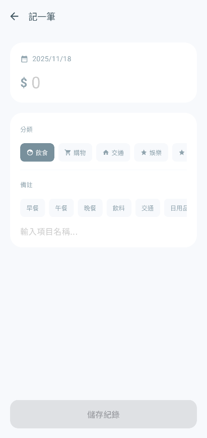
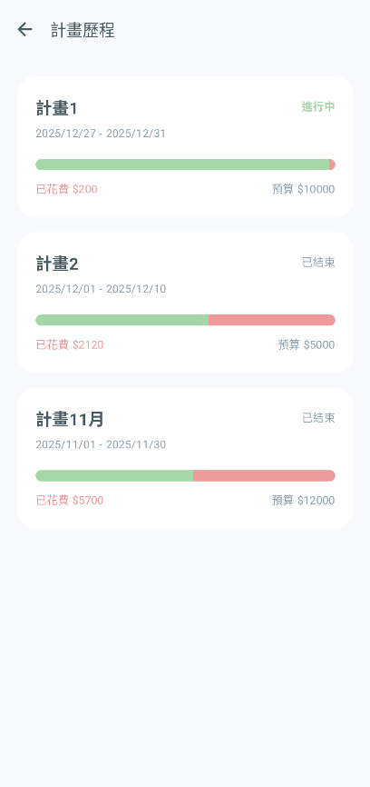
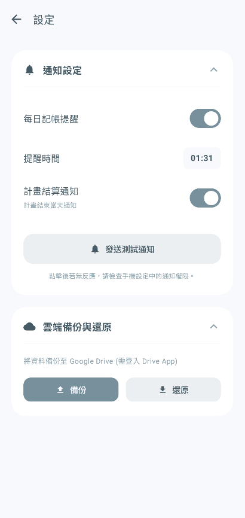

## 📋 Budget Quest - 日系極簡計畫導向記帳 App

### 📖 專案簡介

**Budget Quest** 是一款基於 **MVVM 架構** 與 **Jetpack Compose** 開發的現代化 Android 記帳應用程式。
與傳統流水帳 App 不同，本專案採用 **「計畫導向 (Plan-Based)」** 的核心邏輯。使用者將每一段時期的存錢目標視為一個「庫存管理專案」，透過「專注模式」與「月曆模式」的切換，實現對財務狀況的精準控制與視覺化管理。

整體 UI 採用日系透明感設計（Japanese Minimalist Design），結合流暢的數字跳動動畫與動態色彩回饋，提供無壓力的記帳體驗。

---

### ✨ 核心功能 (Features)

本專案已達成期末專題之所有基本要求及加分項：

#### 1. 核心 CRUD 與資料管理

* **新增消費 (Create)**：自定義鍵盤與分類選擇，支援備註與日期調整。
* **瀏覽清單 (Read)**：
* **專注模式**：顯示當前計畫的每日可用餘額，動態計算累計結餘。
* **月曆模式**：以月曆形式總覽整月消費狀況。


* **詳細資訊 (Read - Detail)**：點擊單日可查看該日所有消費明細。
* **編輯與刪除 (Update / Delete)**：可修改消費金額、分類，或滑動/點擊刪除誤記項目。
* **搜尋與篩選**：支援依照「關鍵字」、「分類」、「標籤」進行複合篩選。

#### 2. 進階計畫管理 (Plan Inventory)

* **多計畫管理**：可建立不同時間段的存錢計畫 (例如：12月旅遊基金、1月生活費)。
* **歷史回顧**：具備完整的計畫歷史列表，透過進度條視覺化展示預算執行率 (綠色為結餘，紅色為透支)。
* **自動防呆**：防止計畫日期重疊，並自動計算每日建議消費額度。

#### 3. 系統架構與優化

* **雲端備份 (Cloud Integration)**：整合 Google Drive (SAF)，實現資料庫的完整備份與還原 (Local-First 隱私優先)。
* **推播通知**：整合 WorkManager 實現每日記帳提醒與計畫結算通知。
* **自定義分類**：使用者可自行新增、隱藏、刪除分類與備註 (Entity 擴充)。
* **訂閱管理**：獨立的固定扣款管理頁面，支援自動寫入消費紀錄。

---

### 📱 畫面展示 (Screenshots)

> **小提示**：所有介面均採用一致的日系極簡風格設計。

| 儀表板 (專注模式) | 儀表板 (月曆模式) | 新增消費 |
| --- | --- | --- |
|  |  |  |

| 統計分析 | 計畫歷史 | 設定與備份 |
| --- | --- | --- |
|  |  |  |

---

### 🛠️ 技術架構 (Tech Stack)

* **語言**：Kotlin
* **UI 框架**：Jetpack Compose (Material Design 3)
* **架構模式**：MVVM (Model-View-ViewModel) + Repository Pattern
* **本地資料庫**：Room Database (SQLite)
* 包含完整 Entity 關聯
* 實作 Migration (Version 1 -> 7)


* **非同步處理**：Coroutines & Flow
* **導航**：Navigation Compose
* **背景任務**：WorkManager (通知排程)
* **雲端整合**：Google Drive Storage Access Framework (SAF)

---

### 📂 專案結構說明 (Project Structure)

本專案嚴格遵守 MVVM 分層原則，主要檔案職責如下：

```text
com.example.budgetquest
├── data/                  # Model 層 (資料來源)
│   ├── BudgetDatabase.kt  # Room 資料庫實體與 Migration 定義
│   ├── BudgetDao.kt       # 資料存取物件 (DAO)，定義 SQL 操作
│   ├── BudgetRepository.kt# 倉庫層介面與實作，隔離 Data 與 UI
│   ├── Entity.kt          # 資料表定義 (Plan, Expense, Category...)
│   └── BackupManager.kt   # 負責 Google Drive 備份與還原邏輯
│
├── ui/                    # View 層 (UI 畫面)
│   ├── AppViewModelProvider.kt # 依賴注入工廠 (DI Factory)
│   ├── dashboard/         # 主儀表板功能
│   │   ├── DashboardScreen.kt    # 主畫面 UI (專注/月曆切換)
│   │   └── DashboardViewModel.kt # 處理日期計算、餘額連動邏輯
│   ├── transaction/       # 記帳核心功能
│   │   ├── TransactionScreen.kt  # 新增/編輯消費頁面
│   │   ├── CategoryManagerScreen.kt # 自定義分類管理 Dialog
│   │   └── DailyDetailScreen.kt  # 每日詳細清單
│   ├── plan/              # 計畫管理功能
│   │   ├── PlanSetupScreen.kt    # 建立/修改計畫表單
│   │   └── PlanViewModel.kt      # 處理計畫邏輯與重疊檢查
│   ├── history/           # 歷史紀錄
│   │   ├── PlanHistoryScreen.kt  # 歷史列表 UI
│   │   └── PlanHistoryViewModel.kt # 讀取歷史資料與統計
│   ├── summary/           # 統計分析
│   │   └── SummaryScreen.kt      # 圓餅圖與進階篩選 UI
│   └── settings/          # 設定
│       └── SettingsScreen.kt     # 通知開關與雲端備份 UI
│
└── worker/                # 背景任務
    └── ReminderWorker.kt  # 實作推播通知的邏輯

```

---

### 💾 資料庫設計 (Database Schema)

本專案使用 Room 建立關聯式資料庫，主要 Entity 包含：

1. **PlanEntity** (主要實體)：定義記帳計畫的週期 (Start/End Date)、總預算、目標存錢金額。
2. **ExpenseEntity**：紀錄每一筆消費，包含金額、日期、分類、備註。
3. **CategoryEntity** / **TagEntity**：提供使用者自定義的分類與標籤選項。
4. **RecurringExpenseEntity**：儲存固定扣款設定。

**Migration 歷程：**

* V1 -> V7：過程中陸續新增了 `Category` 資料表、`planName` 欄位以及 `SubscriptionTag`，並透過 Migration 腳本確保舊資料不遺失。

---

### 🚀 如何執行 (Getting Started)

1. Clone 本專案到本地端。
2. 使用 Android Studio (Hedgehog 或更新版本) 開啟。
3. 等待 Gradle Sync 完成。
4. 連接實機或模擬器 (建議 API 26+)。
5. 點擊 **Run**。

> **注意**：若要測試「雲端備份」功能，請確保測試裝置已安裝 Google Drive 應用程式並登入帳號。
### 📄 License

本專案為期末專題用途。

---
