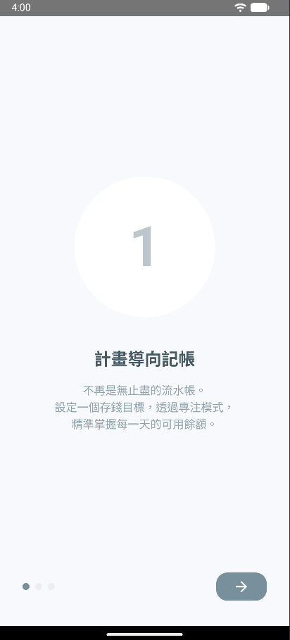
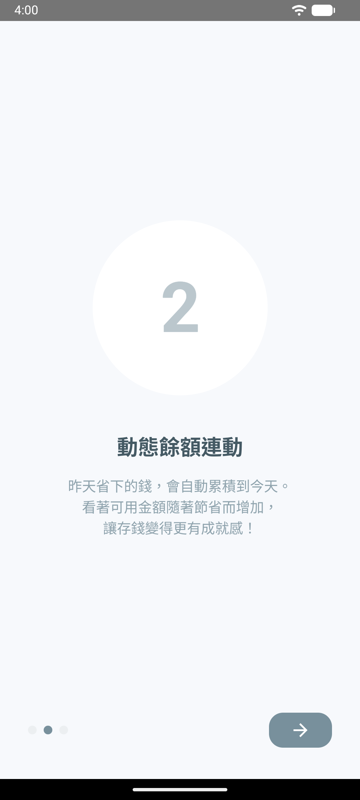
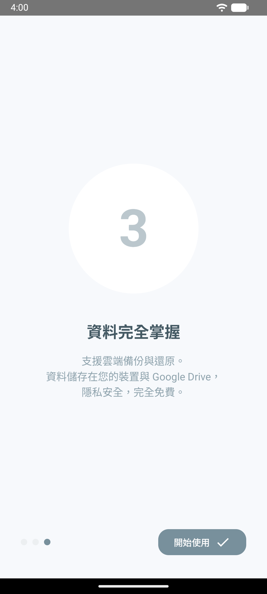
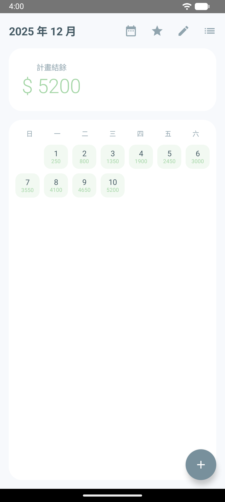
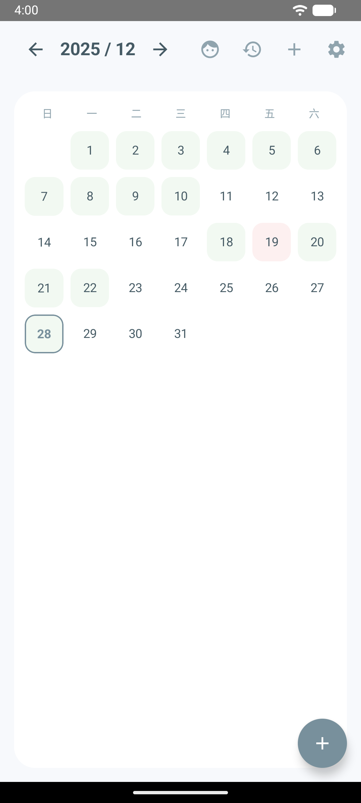
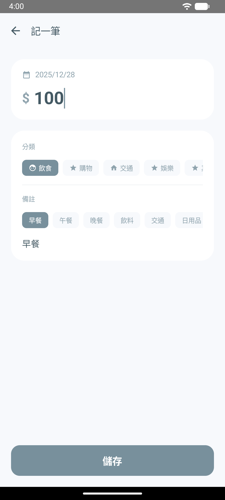
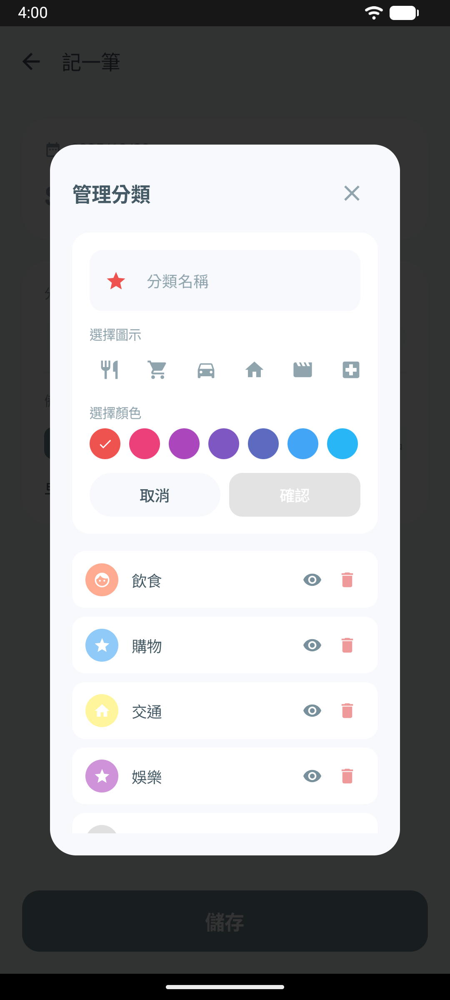
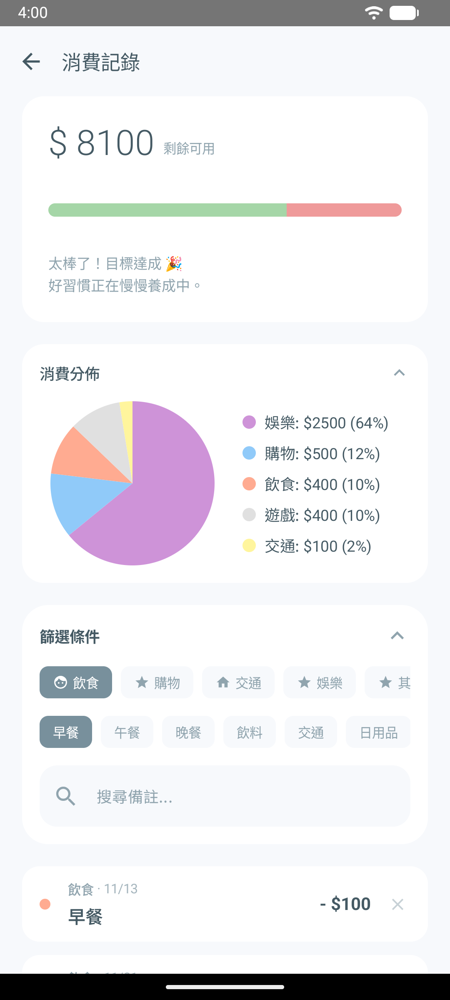
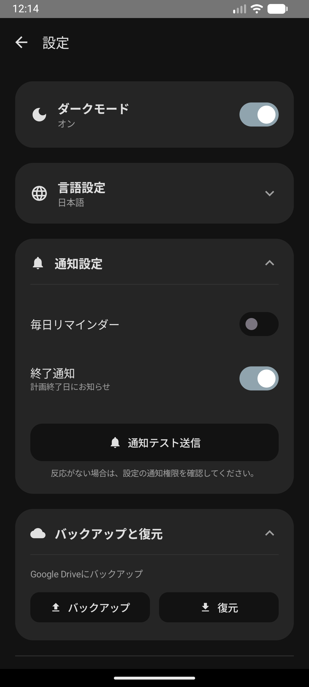

# 📋 Budget Quest - 極簡風格計畫導向記帳 App

| 計畫導向記帳 | 動態餘額連動 | 資料完全掌握 |
| --- | --- | --- |
|  |  |  |

### 📖 專案簡介 (Introduction)

**Budget Quest** 是一款基於 **MVVM 架構** 與 **Jetpack Compose** 開發的現代化 Android 記帳應用程式。

有別於傳統的流水帳 App，本專案採用 **「庫存管理 (Inventory Management)」** 的核心邏輯。使用者設定一段時間的預算目標（計畫），系統透過 **「專注模式」** 與 **「月曆模式」** 的動態切換，協助使用者精準控制每日的「剩餘金錢」，將記帳變成一場達成目標的任務。

---

### ✨ 主要功能 (Core Features)

#### 1. 沉浸式儀表板 (Dashboard)

* **專注模式 (Focus Mode)**：極簡化介面，移除多餘干擾，透過 **跳動數字動畫 (Rolling Number)** 顯示今日可用餘額。綠色代表安全，紅色代表超支，讓財務狀況一目瞭然。
* **月曆總覽 (Calendar Mode)**：直觀的月曆視圖，每日格子上直接顯示當日結餘，提供宏觀的財務視角，點擊即可快速跳轉至當日明細。
* **防手震優化**：全域按鈕與頁面切換皆導入 **Debounce (防抖)** 機制，杜絕誤觸與重複開啟頁面的問題，操作手感更扎實。

#### 2. 高度客製化記帳 (Transaction & Customization)

* **圖片與附檔**：支援消費紀錄附帶照片（拍攝或相簿選取），並支援雲端同步備份，讓回憶與帳目一同保存。
* **自訂分類系統**：使用者不只能新增、編輯、刪除分類，還支援 **自選圖示 (Icon) 與 色彩 (Color)**。
* **智慧防呆**：新增消費時，系統會自動快取日期與分類，並優化了鍵盤與輸入框的互動流暢度，讓記帳過程行雲流水。

#### 3. 計畫與訂閱管理 (Plan & Subscription)

* **多幣別支援**：整合即時匯率 API，支援設定主幣別（如 TWD, USD, JPY），自動換算並顯示資產價值。
* **計畫導向**：支援建立多個不同週期的存錢計畫，系統自動防止日期重疊，確保每一分錢都在規劃之中。
* **固定扣款**：獨立的訂閱管理頁面，支援「每月、每週、每日、自訂間隔」的自動扣款設定。

#### 4. 系統架構與資料安全

* **Firebase 雲端備份**：整合 Firebase Auth (Google Sign-In) 與 Firebase Storage，實現資料庫與圖片的完整雲端備份與還原，支援跨裝置同步。
* **背景通知**：整合 WorkManager 進行每日記帳提醒，確保不錯過任何一筆消費。

---

### ⚙️ 環境設定與 API 配置 (Configuration)

> **⚠️ 注意：本專案整合了雲端服務與外部 API。為確保功能正常運作，請在本地端執行前完成以下環境配置。**

#### 1. Firebase 專案設定 (必要)

本專案依賴 Firebase 進行使用者驗證與雲端備份。

1. 前往 Firebase Console 建立新專案。
2. 新增 Android 應用程式，並確保套件名稱與本專案一致。
3. 下載設定檔，將其放置於專案的 **App 模組根目錄** (`app/`) 下。
4. 於 Firebase 控制台中啟用 **Authentication (Google Sign-In)** 與 **Storage** 功能。

#### 2. 匯率 API 金鑰配置 (建議)

本專案使用 ExchangeRate-API 提供即時匯率換算功能。

1. 前往 ExchangeRate-API 官網 申請 API Key。
2. 於專案原始碼中找到負責處理 **貨幣資料 (Currency Repository)** 的檔案。
3. 將預設的 API Key 變數替換為您申請的金鑰。

#### 3. 地圖 API 金鑰配置 (建議)

本專案使用 Google Maps Platform API 提供地點搜尋與定位資訊。

1. 前往 Google Cloud Platform (GCP) 申請 API Key，並啟用 Maps SDK for Android 與 Places API。
2. 於專案原始碼中找到負責處理 **地圖資料** 的檔案。
3. 將預設的 API Key 變數替換為您申請的金鑰。

---

### 🎨 使用體驗優化 (UX & Personalization)

#### 1. 新手引導與按鈕教學

* **首次引導 (Onboarding)**：流暢的引導頁面，協助使用者建立第一個計畫。
* **互動式教學 (Coach Marks)**：透過聚光燈效果，逐一介紹介面上的功能按鈕。

#### 2. 深色模式支援 (Dark Mode)

* 完美適配深色主題，無論日夜皆能舒適閱讀，並節省電力。

#### 3. 多語言介面 (Localization)

* 內建完整的國際化支援，根據系統語言自動切換：
* **繁體中文 (Traditional Chinese)**
* **英文 (English)**
* **日文 (Japanese)**
* **簡體中文 (Simplified Chinese)**

---

### 📱 畫面展示 (Screenshots)

| 1. 專注儀表板 | 2. 月曆總覽模式 | 3. 新增/編輯消費 |
| --- | --- | --- |
|  |  |  |

| 4. 自訂分類管理 | 5. 統計分析 | 6. 深色模式與多語言 |
| --- | --- | --- |
|  |  |  |

---

### 🛠️ 技術架構 (Tech Stack)

* **語言**：Kotlin
* **UI 框架**：Jetpack Compose (Material Design 3)
* **架構模式**：MVVM (Model-View-ViewModel) + Repository Pattern
* **非同步處理**：Coroutines & Flow
* **網路請求**：Retrofit + Gson (Currency API)
* **雲端服務**：
* **Firebase Auth**：Google 登入驗證
* **Firebase Storage**：資料庫與圖片備份

* **本地資料庫**：Room Database (SQLite)
* **導航**：Navigation Compose
* **背景任務**：WorkManager

---

### 🚀 如何執行 (Getting Started)

1. Clone 本專案到本地端。
2. **完成上述「環境設定與 API 配置」步驟。**
3. 使用 Android Studio (建議使用最新穩定版) 開啟專案。
4. 等待 Gradle Sync 完成。
5. 連接實機或模擬器點擊 **Run**。

---

### 📄 License

本專案為個人學習用途。
